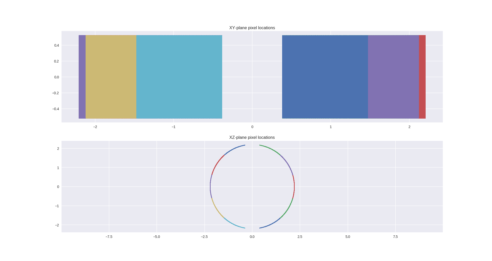

# python-nexus-utilities
Functions to assist with building example NeXus files in the proposed format for ESS from existing NeXus files and Mantid IDFs.

Tested with Python 3.6. You can install dependencies with
```
pip install -r requirements.txt
```

To display the plots generated by `DetectorPlotter` you may need to install tk libraries, on Ubuntu for example:
```
sudo apt install python3-tk
```
on CentOS (with EPEL installed):
```
sudo yum install python34-tkinter
```

## To create a NeXus file

Use `python build.py <input_IDF_file_path>`.

To view a list of optional arguments use `python build.py --help` 

## Examples

Scripts to generate example NeXus files for the ESS can be found at https://github.com/ess-dmsc/generate-nexus-files

## Tools

To assist in creating the IDF to NeXus conversion scripts there are a couple of simple tools: "Detector Plotter" and "HDF5 Size Profiler". 

### Detector Plotter

Plots the pixel offsets in the XY and XZ planes.

Usage example:
```python
from nexusutils.detectorplotter import DetectorPlotter
plotter = DetectorPlotter('example_instruments/wish/WISH_example_gzip_compress.hdf5')
plotter.plot_pixel_positions()
```
example output:



### HDF5 Size Profiler

Prints a table of datasets (ignoring links) from largest to smallest with details of data type, number of elements etc. Can also output a pie chart of dataset sizes.

Usage example:
```python
from nexusutils.hdf5sizeprofiler import HDF5SizeProfiler
profiler = HDF5SizeProfiler('example_instruments/wish/WISH_example_gzip_compress.hdf5')
profiler.print_stats_table()
profiler.draw_pie_chart()
```
example table output (truncated):
```
Total uncompressed size is 4.981903 megabytes, compressed file size is 1.332304 megabytes
  Size (elements)    % of total size  Datatype      Size (bytes)  Dataset name
-----------------  -----------------  ----------  --------------  -------------------------------------------------------
            77824       12.4971       float64             622592  raw_data_1/instrument/detector_1/x_pixel_offset
            77824       12.4971       float64             622592  raw_data_1/instrument/detector_1/y_pixel_offset
            77824       12.4971       float64             622592  raw_data_1/instrument/detector_1/z_pixel_offset
            77824        6.24854      int32               311296  raw_data_1/instrument/detector_1/detector_number
            77824        6.24854      int32               311296  raw_data_1/instrument/detector_10/detector_number
...
```

## Tests

Unit tests require pytest (`pip install pytest`) can be run with
```
pytest
```

An html test coverage report can be generated using pytest-cov (`pip  install pytest-cov`): 
```
pytest --cov-config .coveragerc --cov-report html --cov=. tests/
```
